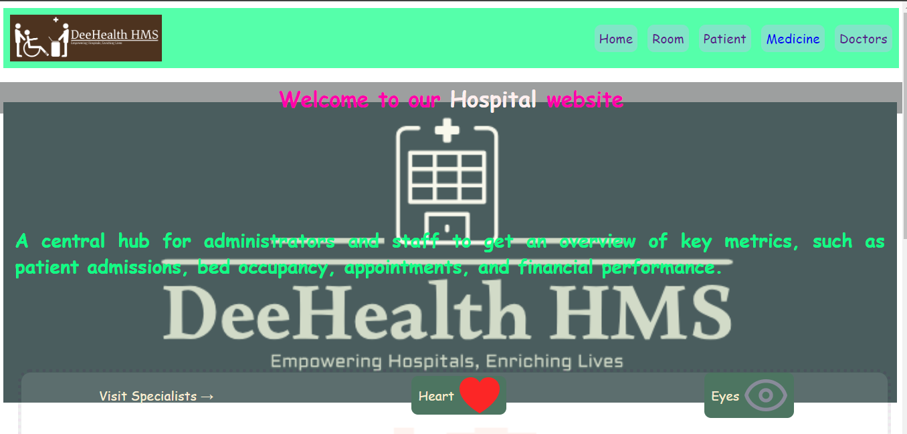

# Dr. CARE HMS (Hospital Management System)

Dr. CARE HMS is a simple Hospital Management System built using HTML, CSS, and JavaScript. It allows hospital staff to manage patient records, appointments, and medical history efficiently.
---

[](https://dr-care-hms.vercel.app/)

## Demo

Explore a live demo of Dr. CARE HMS to see its features in action:

- **Demo Link:** [Dr. CARE HMS Demo](https://dr-care-hms.vercel.app/)

Feel free to interact with the patient management, appointment scheduling, and other features to get a sense of how Dr. CARE HMS can streamline hospital management tasks.

---

## Features

- **Patient Management:**
  - Add, edit, and delete patient records.
  - View patient details including medical history.

- **Appointment Management:**
  - Schedule, reschedule, and cancel appointments.
  - View upcoming appointments.

- **User-friendly Interface:**
  - Intuitive design for easy navigation.
  - Responsive layout suitable for desktop and mobile devices.

- **Resource Directory:**
  - All images can be found in `/images/` and
  - Images for medicines and room types are stored under `/images/medicines` and `/images/rooms` respectively.


## Technologies Used

- **HTML:** Provides the structure and content of the application.
- **CSS:** Styles the HTML elements for a visually appealing interface.
- **JavaScript:** Implements functionality such as data manipulation and event handling.

## Installation

To run Dr. CARE HMS locally:

1. Clone the repository:
   ```
   git clone https://github.com/dee-raj/dr-care-hms.git
   ```

2. Navigate to the project directory:
   ```
   cd dr-care-hms
   ```

3. Open `index.html` in your web browser to start using Dr. CARE HMS.

## Usage

- **Patient Management:**
  - Click on "Patients" to view, add, edit, or delete patient records.
  - Each patient record includes basic information and medical history.
  
### Appointment Management

- **Appointment Scheduling:** 
  - Schedule appointments with doctors and healthcare providers.
  - Manage appointment slots and availability, with options to reschedule or cancel appointments as needed.

- **Reminders and Notifications:** 
  - Send automated reminders to patients about upcoming appointments via email or SMS.
  - Notify healthcare providers of schedule changes and patient arrivals.

- **Responsive Design:**
  - The application is responsive, adapting to different screen sizes.
  - Accessible on both desktop and mobile devices.

## Contributing

Contributions are welcome! If you'd like to add new features or improve existing ones, feel free to fork the repository and submit a pull request.


## License

This project is licensed under the MIT License - see the [LICENSE](LICENSE) file for details.

## Acknowledgments

- Inspired by the need for simple and efficient hospital management tools.
- Built as a project for learning HTML, CSS, and JavaScript.
